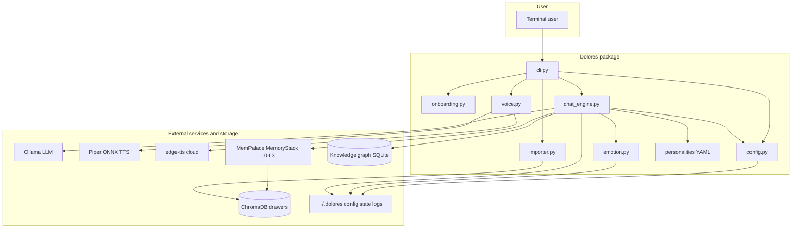
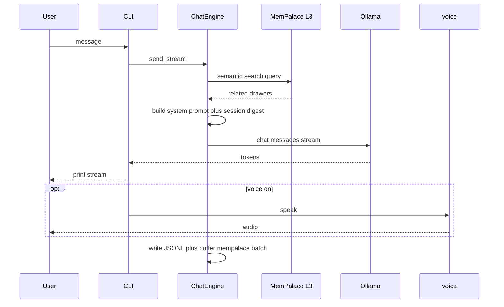

<p align="center">
  
</p>

# Dolores

### A local-first terminal companion that remembers — Ollama for chat, [MemPalace](https://github.com/milla-jovovich/mempalace) for memory, Piper or Edge for voice.

Every session with a local model starts cold: no project context, no last week’s decisions, no thread of how you like to work. Cloud assistants solve that with hosted memory; Dolores solves it **on your machine**: Chroma-backed semantic recall, optional knowledge-graph facts, and a small emotion layer (mood tags in replies, affection bumps for sweet vs neutral chat, a penalty for rude phrasing, plus **extra system guidance when insults/slurs are detected** so replies stay hurt/cold rather than flirty). Long gaps without chatting also apply a small daily affection decay (see `emotion.py`).

[繁體中文說明](README.zh-TW.md)

**Companion, not a framework** — Rich terminal UI, YAML personas, TTS you can run offline (Piper) or lean on Edge when you accept network use.

**MemPalace-aligned memory** — Wake-up context plus on-demand search; conversation write-back with batching and AAAK compression where configured; simple fact paths into the KG when enabled.

**Your files, your palace** — Import from `personal/` (txt, md, pdf, docx, csv, xlsx, json, jsonl, png/jpg/jpeg — image paths use PyMuPDF text extraction, not full OCR) into the same Chroma store MemPalace uses.

Quick Start · [How you use it](#how-you-actually-use-it) · [Memory flow](#how-memory-works) · [CLI](#all-commands) · [Config](#configuration) · [Architecture](#system-architecture) · [Screenshot](#screenshot)

---

<a id="screenshot"></a>

## Screenshot

<p align="center">
  
</p>

Startup shows **Initializing memory palace…**, then the **[ SYSTEM ]** block (MemPalace core, Ollama model, voice backend, drawer count) and **[ ♡ COMPANION ]** (name, mood, affection, session count). Below that, chat with optional `[mood:…]` tags in replies and a compact status bar (mood, affection, voice, model).

---

## Quick Start

```bash
cd /path/to/dolores
pip install -e .
```

**Prerequisites:** Python 3.9+, [Ollama](https://ollama.com/) running locally, and a working **MemPalace** install so `mempalace` imports resolve (`pip install -e path/to/mempalace` or your usual layout).

```bash
python -m dolores
# or
dolores
```

First launch runs onboarding (persona, model, optional `personal/` import, Q&A) and writes `~/.dolores/config.json`.

---

## How you actually use it

1. **Talk** — The model streams replies in the terminal; optional TTS reads them aloud (`/voice`, `/tts`, `/voices`).
2. **Stay in character** — Switch personas with `/persona`. Config key is the YAML **stem**: `gentle` (Clara), `tsundere` (Vivian), `playful` (Luna), `sarcastic` (Scarlett), `melancholy` (Mira) under `dolores/personalities/`.
3. **Ground in memory** — Each turn can pull related drawers via MemPalace search; recent dialogue is summarized so the current sitting does not evaporate mid-session.
4. **Feed the palace** — Drop files into `personal/` and run `/import` to ingest into Chroma (same persistence as MemPalace under `~/.mempalace/`).
5. **Inspect state** — `/status` shows mood, affection, memory stats, model, and voice settings.

You do not need a cloud API for the LLM path; TTS defaults to **Piper** (offline after voice download). **Edge TTS** is an optional online fallback.

---

## How memory works

Dolores follows the same **layered idea** as MemPalace’s stack, adapted for an interactive CLI:

| Layer | Role in Dolores |
| ----- | ---------------- |
| **Session digest** | Recent turns compressed into the system prompt so the model keeps thread continuity *inside* this sitting. |
| **Wake-up + search** | MemPalace-style context: critical facts where configured, plus semantic retrieval (L3-style) when the engine queries the palace. |
| **Write-back** | Buffered exchanges flushed every 4 turns to Chroma: `dolores/conversations` (AAAK-compressed) plus `dolores/conversations_raw` (verbatim); JSONL logs under `~/.dolores/conversations/`. |
| **Structured facts** | Optional triples in MemPalace’s SQLite KG when fact extraction paths are used. |

Verbatim storage and benchmark semantics are **MemPalace’s**; Dolores orchestrates Ollama, prompts, emotion state, and TTS around that stack.

---

## All commands

| Command | Description |
| -------- | ----------- |
| `/help` | Show help |
| `/status` | Mood, affection, memory stats, model, voice |
| `/voice` | Toggle speech on/off |
| `/tts` | Engine: `piper` or `edge` |
| `/voices` | Choose Piper voice id or Edge `ShortName` (persisted) |
| `/model` | Switch Ollama model |
| `/import` | Import files from `personal/` into MemPalace |
| `/persona` | Switch personality |
| `/quit` | Exit (flushes buffered memory batch) |

**Aliases:** `/exit`, `/q` → quit · `/h` → help · `/voicepick` → `/voices`

---

## Configuration

Primary file: `~/.dolores/config.json` (created after onboarding). Keys are populated by the wizard and CLI; personality, `personal_data_path`, Ollama model, and TTS choices live here.

Example shape (values illustrative — yours will match your onboarding choices):

```json
{
  "personality": "gentle",
  "ollama_model": "gemma4:e4b",
  "tts_backend": "piper",
  "piper_voice": "zh_CN-huayan-medium"
}
```

Defaults in code include `DEFAULT_OLLAMA_MODEL` and `DEFAULT_PERSONALITY` in `dolores/config.py` if the file is missing keys.

---

## Data locations

| Path | Purpose |
| ---- | -------- |
| `~/.dolores/config.json` | User settings |
| `~/.dolores/state.json` | Mood and affection |
| `~/.dolores/conversations/*.jsonl` | Session logs |
| `~/.dolores/imported_hashes.json` | Import deduplication (path + content hash) for `/import` |
| `~/.dolores/piper_voices/` | Piper ONNX models |
| `~/.mempalace/palace/` | MemPalace Chroma persistence |
| `~/.mempalace/knowledge_graph.sqlite3` | Temporal KG (when used) |
| `personal/` (project root) | Private documents to import; keep out of VCS (see `.gitignore`) |

---

## System architecture



### Request flow (one chat turn)



---

## Project structure

```
dolores/
├── pyproject.toml
├── requirements.txt
├── README.md
├── README.zh-TW.md
├── assets/
│   ├── dolores-icon.png      # Project logo
│   └── screenshot-terminal.png  # README: in-app terminal UI
├── personal/              # Your files to import (gitignored by default)
├── data/avatars/          # Reserved for future use
└── dolores/
    ├── __init__.py
    ├── __main__.py
    ├── cli.py               # Rich CLI, commands, TTS hook
    ├── chat_engine.py       # Ollama + memory + emotion + write-back
    ├── config.py
    ├── emotion.py
    ├── voice.py             # Piper + edge-tts + pygame playback
    ├── onboarding.py
    ├── importer.py
    └── personalities/       # *.yaml personas
```

---

## Tech stack

| Area | Technology |
| ---- | ---------- |
| Language | Python 3.9+ |
| CLI UI | Rich |
| LLM client | `ollama` Python package |
| Memory | MemPalace (`MemoryStack`, `KnowledgeGraph`, `miner.add_drawer`, `Dialect`) |
| Vectors | ChromaDB (via MemPalace) |
| TTS | `piper-tts`, `edge-tts`, `pygame` |
| Documents | PyMuPDF, python-docx, openpyxl |
| Personas | PyYAML |

---

## Requirements

- **Python** 3.9+
- **Ollama** installed and running on the same machine
- **MemPalace** importable in the same environment as Dolores
- Optional: GPU for faster Ollama inference

---

## Roadmap

### Phase 2: Web UI + Live2D + AI-generated avatars
- FastAPI backend + browser-based chat
- On first launch, optional AI-generated character art (local SD or API)
- Live2D Cubism; emotion tags drive expressions — see [Open-LLM-VTuber](https://github.com/t41372/Open-LLM-VTuber) for frontend patterns

### Phase 3: Telegram Bot
- `python-telegram-bot` for mobile/desktop messaging

### Phase 4: Advanced emotion model
- Plutchik-style dimensions, decay curves, relationship depth

### Phase 5: STT + lip-sync
- `faster-whisper` for local speech; optional Audio2Face for Live2D lips

### Phase 6: Automatic KG extraction
- Richer automatic structuring of conversation into the knowledge graph

---

## Contributing

<!-- TODO: branching, PRs, code style (ruff), tests -->

---

## License

MIT — see `pyproject.toml`. **Piper** upstream is GPL-3.0; comply if you redistribute Piper-linked binaries or derivative works.

---

## Disclaimer

Fiction-inspired branding only; not affiliated with HBO or Westworld. Hobby / educational software: you are responsible for use, and for any data in `personal/` or memory stores.
