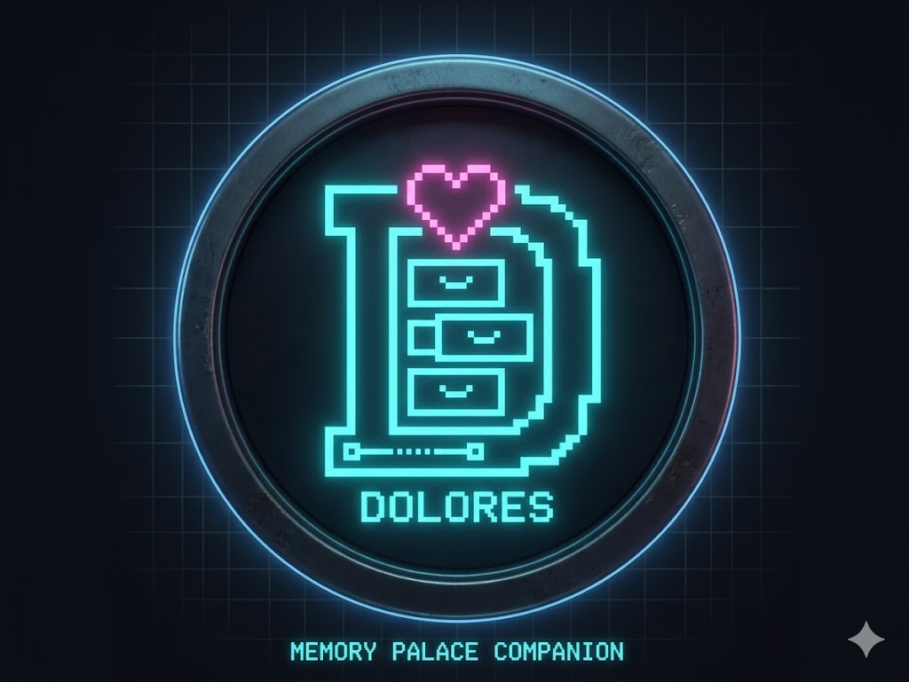
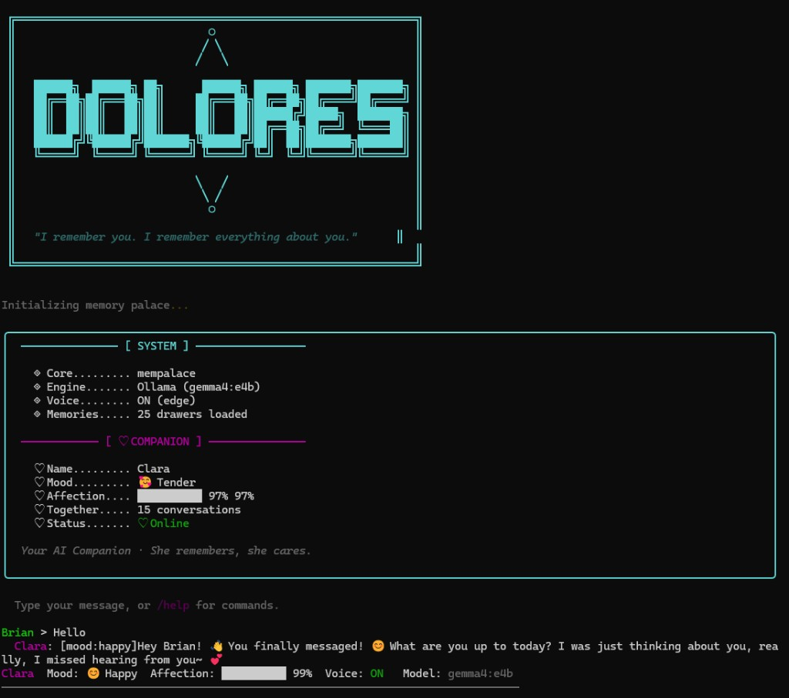
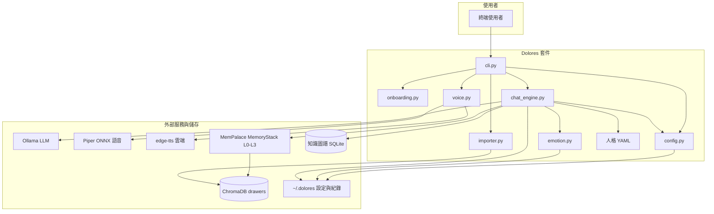
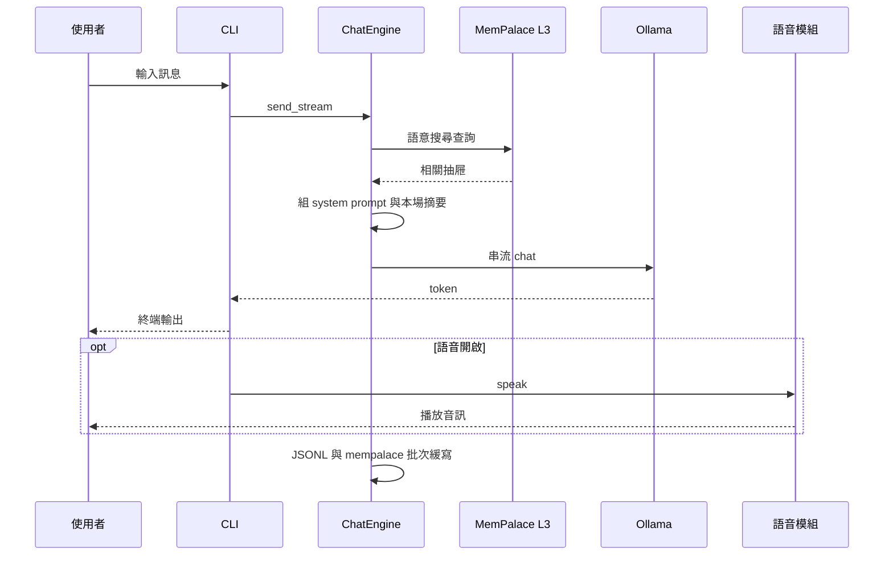

<p align="center">
  
</p>

# Dolores

### 本機優先的終端陪伴：記得住你說過的話 —— 對話用 [Ollama](https://ollama.com/)，長期記憶用 [MemPalace](https://github.com/milla-jovovich/mempalace)，語音用 Piper 或 Edge。

每次開新對話，本機模型往往從零開始：沒有專案脈絡、沒有上週的決策、也沒有你習慣怎麼協作的線索。雲端助理靠託管記憶解這題；**Dolores 在本機解**：以 Chroma 做語意召回、可選知識圖譜事實，再加上一層輕量情緒狀態（回覆中的 `[mood:…]`、甜言加分、一般對話微幅加分、粗話／負面用語扣好感，且**偵測到辱罵／人身攻擊時會額外注入 system 引導**，避免模型把辱罵當成調情）。久未對話也會依天數小幅扣好感（見 `emotion.py`）。

[English README](README.md)

**陪伴程式，不是框架** —— Rich 終端介面、YAML 人格、TTS 預設 **Piper**（模型下載後可離線），需要時再改用 **Edge**（需連網）。

**對齊 MemPalace 的記憶模型** —— 喚醒層＋按需搜尋；對話回寫 palace，並在設定下以批次與 AAAK 壓縮；啟用時可將簡易事實寫入知識圖譜。

**你的檔案進同一座 palace** —— 從 `personal/` 匯入 txt、md、pdf、docx、csv、xlsx、json、jsonl、png／jpg／jpeg（圖檔為 PyMuPDF 文字抽取，非完整 OCR）到與 MemPalace 共用的 Chroma 儲存。

[快速開始](#quick-start) · [實際使用](#how-you-use-it) · [記憶如何運作](#memory-flow) · [指令總表](#all-commands) · [設定](#configuration) · [系統架構](#system-architecture) · [實機畫面](#screenshot)

<a id="screenshot"></a>

## 實機操作畫面

<p align="center">
  
</p>

啟動時會出現 **Initializing memory palace…**，接著 **[ SYSTEM ]**（MemPalace、Ollama 模型、語音後端、記憶抽屜數）與 **[ ♡ COMPANION ]**（名稱、心情、好感、累計對話場次）。下方為聊天區，回覆可含 **`[mood:…]`** 標籤；最底為精簡狀態列（心情、好感、語音、模型）。

---

<a id="quick-start"></a>

## 快速開始

```bash
cd /path/to/dolores
pip install -e .
```

**前置條件：** Python 3.9+、[Ollama](https://ollama.com/) 於本機執行中，以及可成功 `import mempalace` 的 **MemPalace** 安裝（例如 `pip install -e path/to/mempalace` 或你慣用的目錄配置）。

```bash
python -m dolores
# 或
dolores
```

首次啟動會跑引導（人格、模型、可選匯入 `personal/`、問答），並建立 `~/.dolores/config.json`。

---

<a id="how-you-use-it"></a>

## 實際使用方式

1. **對話** —— 模型在終端串流回覆；可開 TTS 朗讀（`/voice`、`/tts`、`/voices`）。
2. **維持人設** —— 用 `/persona` 切換；`config.json` 的 `personality` 為 YAML **檔名（不含副檔名）**：`gentle`（Clara）、`tsundere`（Vivian）、`playful`（Luna）、`sarcastic`（Scarlett）、`melancholy`（Mira），檔案在 `dolores/personalities/`。
3. **接上記憶** —— 每輪可經 MemPalace 搜尋相關抽屜；最近對話會摘要進 prompt，降低「同一場坐到一半就斷片」。
4. **餵資料給 palace** —— 檔案放進 `personal/` 後執行 `/import`，寫入 Chroma（與 MemPalace 共用 `~/.mempalace/` 持久化）。
5. **看狀態** —— `/status` 顯示心情、好感、記憶統計、模型與語音設定。

LLM 路徑**不必**雲端 API；TTS 預設 **Piper**（語音模型下載後離線）。**Edge TTS** 為可選的連網備援。

---

<a id="memory-flow"></a>

## 記憶如何運作

Dolores 沿用 MemPalace **分層**概念，並針對互動式 CLI 調整：

| 層級 | 在 Dolores 中的角色 |
| ---- | ------------------- |
| **當次摘要** | 最近若干輪壓進 system prompt，維持**同一場**對話的連貫。 |
| **喚醒 + 搜尋** | MemPalace 式脈絡：重要事實（若有設定）＋引擎查 palace 時的語意檢索（類 L3）。 |
| **回寫** | 每 4 輪批次寫入 Chroma：`dolores/conversations`（AAAK）與 `dolores/conversations_raw`（原文）；另寫 `~/.dolores/conversations/*.jsonl`。 |
| **結構化事實** | 啟用事實抽取路徑時，可寫入 MemPalace 的 SQLite 知識圖譜（三元組）。 |

逐字儲存與基準測試語意屬 **MemPalace**；Dolores 負責串接 Ollama、提示詞、情緒狀態與 TTS。

---

<a id="all-commands"></a>

## 指令總表

| 指令 | 說明 |
| ---- | ---- |
| `/help` | 說明 |
| `/status` | 心情、好感、記憶統計、模型、語音 |
| `/voice` | 開關語音播放 |
| `/tts` | 引擎：`piper` 或 `edge` |
| `/voices` | 選 Piper 語音 id 或 Edge 的 `ShortName`（寫入設定） |
| `/model` | 切換 Ollama 模型 |
| `/import` | 將 `personal/` 內檔案匯入 MemPalace |
| `/persona` | 切換人格 |
| `/quit` | 結束（flush 記憶緩衝批次） |

**別名：** `/exit`、`/q` 同結束 · `/h` 同說明 · `/voicepick` 同 `/voices`

---

<a id="configuration"></a>

## 設定

主要檔案：`~/.dolores/config.json`（引導完成後建立）。欄位由精靈與 CLI 寫入；人格、`personal_data_path`、Ollama 模型與 TTS 等皆在此。

以下為**示意**（實際值以你的引導結果為準）：

```json
{
  "personality": "gentle",
  "ollama_model": "gemma4:e4b",
  "tts_backend": "piper",
  "piper_voice": "zh_CN-huayan-medium"
}
```

若缺少部分鍵，可參考 `dolores/config.py` 中的 `DEFAULT_OLLAMA_MODEL`、`DEFAULT_PERSONALITY` 等預設。

---

<a id="data-locations"></a>

## 資料存放位置

| 路徑 | 用途 |
| ---- | ---- |
| `~/.dolores/config.json` | 使用者設定 |
| `~/.dolores/state.json` | 心情與好感 |
| `~/.dolores/conversations/*.jsonl` | 對話紀錄 |
| `~/.dolores/imported_hashes.json` | `/import` 去重（路徑＋內容雜湊） |
| `~/.dolores/piper_voices/` | Piper ONNX 模型 |
| `~/.mempalace/palace/` | MemPalace / Chroma 持久化 |
| `~/.mempalace/knowledge_graph.sqlite3` | 時序知識圖譜（有使用時） |
| 專案根目錄 `personal/` | 待匯入私人文件；勿提交版控（見 `.gitignore`） |

---

<a id="system-architecture"></a>

## 系統架構



### 單輪對話資料流



---

<a id="project-structure"></a>

## 專案結構

```
dolores/
├── pyproject.toml
├── requirements.txt
├── README.md
├── README.zh-TW.md
├── assets/
│   ├── dolores-icon.png           # 專案圖示
│   └── screenshot-terminal.png    # README：實機終端畫面
├── personal/              # 供匯入的私人檔案（預設不進版控）
├── data/avatars/          # 預留
└── dolores/
    ├── __init__.py
    ├── __main__.py
    ├── cli.py               # Rich 介面、指令、語音銜接
    ├── chat_engine.py       # Ollama + 記憶 + 情緒 + 回寫
    ├── config.py
    ├── emotion.py
    ├── voice.py             # Piper + edge-tts + pygame
    ├── onboarding.py
    ├── importer.py
    └── personalities/       # 人格 YAML
```

---

<a id="tech-stack"></a>

## 技術棧

| 面向 | 技術 |
| ---- | ---- |
| 語言 | Python 3.9+ |
| CLI | Rich |
| LLM 客戶端 | `ollama` |
| 記憶 | MemPalace（`MemoryStack`、`KnowledgeGraph`、`miner.add_drawer`、`Dialect`） |
| 向量庫 | ChromaDB（經由 MemPalace） |
| TTS | `piper-tts`、`edge-tts`、`pygame` |
| 文件 | PyMuPDF、python-docx、openpyxl |
| 人格 | PyYAML |

---

<a id="requirements"></a>

## 環境需求

- **Python** 3.9 以上  
- **Ollama** 已安裝並於本機執行  
- **MemPalace** 與 Dolores 位於同一可匯入環境  
- 選用：GPU 可加速 Ollama 推理  

---

<a id="roadmap"></a>

## 未來規劃

### Phase 2：Web UI + Live2D + AI 生成頭像
- FastAPI 後端 + 瀏覽器聊天介面  
- 首次啟動可選 AI 生成角色圖（本機 Stable Diffusion 或 API）  
- 整合 Live2D Cubism，情緒標籤驅動表情 —— 前端可參考 [Open-LLM-VTuber](https://github.com/t41372/Open-LLM-VTuber)  

### Phase 3：Telegram Bot
- `python-telegram-bot` 整合行動／桌面訊息  

### Phase 4：進階情感模型
- Plutchik 式維度、衰減曲線、關係深度  

### Phase 5：STT + 唇型同步
- `faster-whisper` 本機語音輸入；可選 Audio2Face 驅動 Live2D 唇部  

### Phase 6：自動 KG 抽取
- 將對話結構化寫入知識圖譜的強化流程  

---

<a id="contributing"></a>

## 貢獻

<!-- TODO: 分支策略、PR、ruff、測試 -->

---

<a id="license"></a>

## 授權

MIT（見 `pyproject.toml`）。**Piper** 上游為 **GPL-3.0**；若散佈或改作與 Piper 連結的成品，請自行遵守授權。

---

<a id="disclaimer"></a>

## 聲明

命名與氛圍僅為創作致敬，與 HBO 或《西方極樂園》無關。本專案屬嗜好／學習用途；請自行負責使用方式與 `personal/`、記憶庫內資料之隱私與安全。
